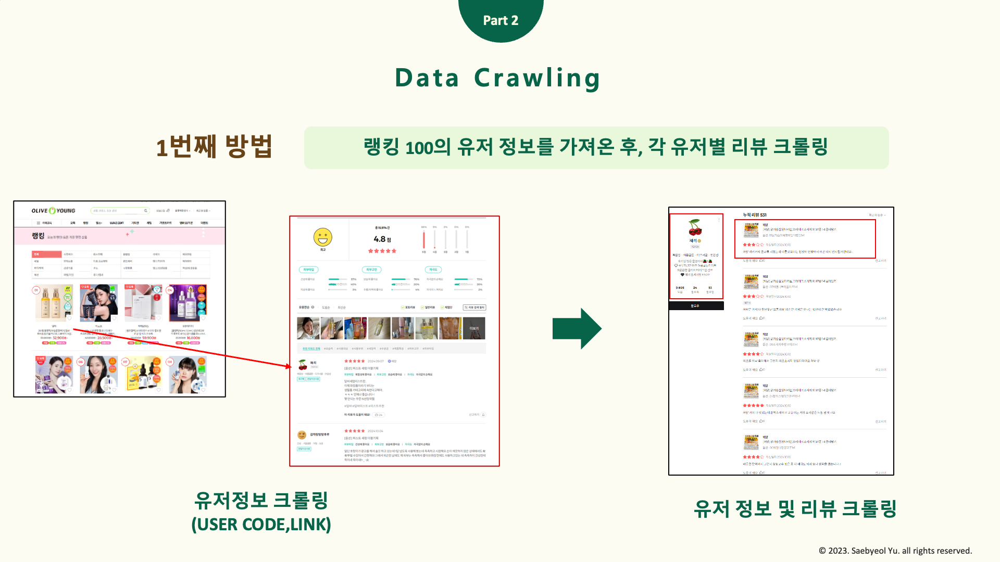
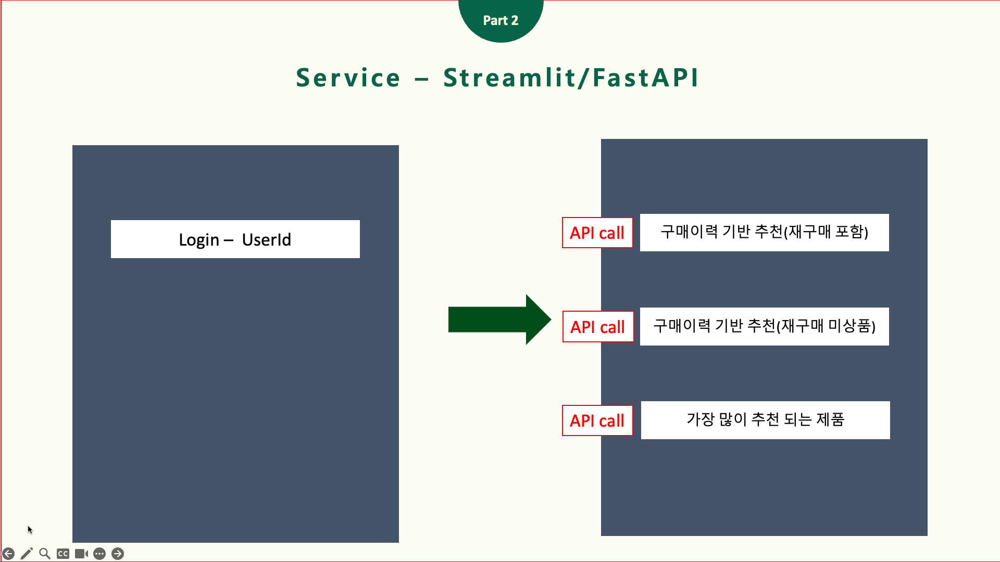

# 올리브영 리뷰를 활용한 추천시스템
## Team

|  |  |  |  |  |
| :--------------------------------------------------------------: | :--------------------------------------------------------------: | :--------------------------------------------------------------: | :--------------------------------------------------------------: | :--------------------------------------------------------------: |
|            [김지환](https://github.com/jihwanK)             |            [김윤환](https://github.com/yoon-py)             |            [변혜영](https://github.com/jenny20240401)             |            [문수민](https://github.com/soomin8442)             |            [최승민](https://github.com/choivember)             |
|                            팀장, 담당 역할                             |                            담당 역할                             |                            담당 역할                             |                            담당 역할                             |                            담당 역할                             |

## 0. Overview
### Environment
- Ubuntu 20.04
- MacOS
- Windows

### Requirements
- requirements.txt

## 1. Competiton Info

### Overview

K-Beauty로 대표되는 올리브영은 국내 최대의 Drug store로 상당히 많은 고객이 있습니다. 현재 주요 상권지에 있는 오프라인 매장뿐 아니라 온라인 스토어 역시 성행 중에 있습니다. 특히 굉장히 많은 유저들이 활발히 사용하고 있는 것으로 보이는 올리브영의 온라인 스토어에서는 여러 추천시스템을 적극적으로 활용 중에 있습니다. 저희는 이번 프로젝트를 통해 이 올리브영의 추천시스템을 단순히 비슷한 유저들의 아이템을 추천해주는 것을 넘어 각 제품의 리뷰를 분석하여 유저에게 가장 적합한 아이템을 추천해주려합니다. 

### Schedule
September 30, 2024 ~ October 11, 2024

## 2. Components

### Directory

```bash
.
├── README.md
├── data.dvc
├── logs
│   └── tmp
├── requirements.txt
└── src
    ├── crawler
    │   ├── jihwan
    │   │   ├── crawler_partial.py
    │   │   ├── crawler_product_info.py
    │   │   ├── crawler_v2.py
    │   │   ├── crawler_v3.py
    │   │   ├── crawler_v4.py
    │   │   ├── crawler_v5.py
    │   │   ├── run_parallel.py
    │   │   └── url_crawler.py
    │   └── soomin
    │       └── crawler
    │           ├── crawler2.ipynb
    │           └── data_processing.ipynb
    ├── mlops
    │   ├── api
    │   │   ├── data_loader.py
    │   │   ├── img_url.py
    │   │   ├── main.py
    │   │   ├── model.py
    │   │   └── model_loader.py
    │   └── streamlit
    │       └── main.py
    ├── model
    │   ├── jihwan
    │   │   ├── NCF.ipynb
    │   │   ├── collaborative-filtering.ipynb
    │   │   ├── evaluation.py
    │   │   └── lightfm.ipynb
    │   └── soomin
    │       └── RecSys_Model
    │           ├── SVD_RecSys copy.ipynb
    │           ├── SVD_RecSys.ipynb
    │           ├── model copy.ipynb
    │           ├── model.ipynb
    │           └── model_rating_sentiment.ipynb
    └── preprocessing
        └── jihwan
            └── preprocessing.ipynb
```

## 3. Data descrption

### Dataset overview



### Sentiment score


### Data Processing


## 4. Modeling

### Model descrition


### Modeling Process


## 5. Result

### Output


## 5. Streamlit + FastAPI

### Streamlit


